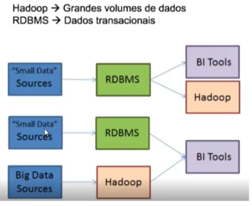

# Construindo Big Data com Cluster de Hadoop e Ecossistema

<p style="color: red"><b>Seção 1-5 foi extraído do curso no youtube. O curso está depreciado devido a desatualização do ambiente</b></p>

***curso:** https://www.udemy.com/course/construindo-big-data-com-cluster-de-hadoop-e-ecossistema/*

***outros:***

*https://www.youtube.com/playlist?list=PLeFetwYAi-F_l-NP-TUE2MqKeu_haMP79* 

*https://github.com/toticavalcanti/Curso_Hadoop*

<h2 style="color: red">1 - Baixando e configurando a máquina Cloudera </h2>

**Download Cloudera-VM**<br>

https://downloads.cloudera.com/demo_vm/virtualbox/cloudera-quickstart-vm-5.13.0-0-virtualbox.zip

**Download Putty**<br>

https://www.chiark.greenend.org.uk/~sgtatham/putty/latest.html

**Download WinSCP**<br>

https://winscp.net/download/WinSCP-6.1.2-Setup.exe

**Autenticação**<br>

- login: *root* ou *cloudera*
- senha: *cloudera*

**Configurações de rede**

 </img>

 </img>

**Na VM-Cloudera digitar `ifconfig` no CLI para obter os IPS**

 </img>

**Utilizar ip `eth1` ou `eth0` no Putty e WinSCP**

 </img>

<h2 style="color: red">2 - Componentes principais </h2>

**Há dois tipos de nós básicos**

- **NÓS MESTRES (MASTERS)** coordena os nós trabalhadores, geralmente são os pontos de entrada para o acesso do usuário ao cluster;
- **NÓS TRABALHADORES** aceitam as tarefas designadas pelos nós mestres para armazenar dados, ler dados ou executar uma aplicação em particular.

Tanto o HDFS como o YARN têm vários serviços mestres responsáveis pela coordenação dos serviços trabalhadores que executam em cada nó

**Serviços do HDFS**

- **NAMENOME (MESTRE)** armazena a árvore de diretórios do sistema de arquivos, metadados de arquivos e as localizações de cada arquivo nc cluster. ele não armazena dados e nem passa dados do datanode ao cliente, o que ele faz é apontar os datanodes corretos aos clientes
- **NAMENOME SECUNDÁRIO (MESTRE)** executam tarefas de manutenção (housekeeping) e de pontos de verificação (checkpointing) em nome do namenode (ele não é um namenode de backup)
- **DATANODE (TRABALHADOR)** armazena e administra blocos HDFS no disco local e informa a saúde e o status de repositórios individuais de dados ao NAMENOME.

**Serviços do YARN**

- **ResourceManager (MESTRE)** aloca e monitora recursos disponíveis no cluster (memória e processadores) para as aplicações e trata do escalonamento dos jobs no cluster
- **ApplicationMaster (MESTRE)** coordena uma aplicação em particular executada no cluster de acordo com o escalonamento feito pelo ResourceManager
- **NodeManager (TRABALHADOR)** executa e administra tarefas de processamento em um nó individual e informa sobre a saúde e o status das tarefas à medida que elas executam.

<h2 style="color: red">3 - Comandos básicos </h2>

`hadoop` O comando principal do Hadoop.

`fs` Indica que a operação deve ser realizada no sistema de arquivos distribuído do Hadoop.

**Listar o conteúdo do diretório raiz no sistema de arquivos distribuído do Hadoop**

`hadoop fs -ls /` 

- `-ls`: A opção que significa "listar". Isso solicita ao Hadoop que liste o conteúdo do diretório especificado.
- `/`: O caminho do diretório no sistema de arquivos distribuído do Hadoop. Neste caso, é o diretório raiz, indicado pelo caractere "/".

**Criar a estrutura de diretórios necessária para armazenar dados no caminho especificado no sistema de arquivos distribuído do Hadoop**

`hadoop fs -mkdir -p ~user/vlsf2/txts`

- `-p`: Essa opção permite criar diretórios pais conforme necessário. Se o diretório pai não existir, ele será criado junto com o diretório especificado.
- `~user/vlsf2/txts`: O caminho do diretório que você deseja criar.

**Copiar o arquivo local `shakespeare.txt` para o diretório `/user/vlsf2/txts` no sistema de arquivos distribuído do Hadoop**

`hadoop fs -put shakespeare.txt /user/vlsf2/txts`

- `-put`: Indica que você deseja copiar um arquivo do sistema de arquivos local para o HDFS.
- `shakespeare.txt`: O nome do arquivo local que você deseja copiar para o HDFS.
- `/user/vlsf2/txts`: O caminho no HDFS para onde o arquivo será copiado. Neste caso, o caminho é `/user/vlsf2/txts`.

### Acessando via página web

No seu navegador, acessar através o mesmo IP que você se conecta com o Putty ou WinSCP utilizando a porta *8888* http://192.168.1.86:8888/<br>
O HUE, que significa "Hadoop User Experience", é uma interface web de código aberto que facilita a interação com o ecossistema Hadoop. Ele fornece uma interface gráfica para facilitar o gerenciamento, monitoramento e utilização de várias ferramentas e serviços no ambiente Hadoop.

Algumas das funcionalidades do HUE incluem:

1. **Exploração de Dados:** Permite explorar e visualizar dados armazenados no Hadoop HDFS.
2. **Querying e Processamento de Dados:** Oferece suporte a consultas interativas no Hive (um sistema de data warehousing construído sobre o Hadoop) e ao editor de scripts Pig (uma linguagem de alto nível para processamento de dados no Hadoop).
3. **Trabalhos MapReduce:** Facilita o gerenciamento e monitoramento de trabalhos MapReduce.
4. **Agendamento de Trabalhos:** Permite agendar trabalhos no Oozie, um serviço de orquestração de fluxo de trabalho para o Hadoop.
5. **Gerenciamento de Metadados:** Oferece uma interface para gerenciar metadados no Hadoop, como tabelas Hive e fluxos Oozie.
6. **Gerenciamento de Segurança:** Permite a administração de permissões e políticas de segurança para os dados e serviços Hadoop.
7. **Integração com outros Serviços:** Integra-se com vários serviços Hadoop, tornando mais fácil para os usuários interagirem com esses serviços por meio de uma interface gráfica.

<center>
  <p>Localizando os arquivos armazenados no HDFS através do HUE</p>
</center>

 </img>

<center>
  <p>Exemplo do arquivo shakespeare.txt no HDFS</p>
</center>
 </img>

 </img>

<h2 style="color: red">4 - Contagem de palavras usando PySpark  </h2>

Entre no shell do Spark digitando `pyspark`

```python
# -*- coding: utf-8 -*-
from pyspark import SparkContext, SparkConf

#Cria a app com o nome WordCount
conf = SparkConf().setAppName("WordCount")

#Instacia o SparkContext -- Não é obrigatório porque o Spark já cria um SparkContext
sc = SparkContext.getOrCreate()

#Cria o RDD com o conte�do do shakespeare.txt
contentRDD = sc.textFile("/user/vlsf2/txts/shakespeare.txt")

#Elimina as linha em branco
filter_empty_lines = contentRDD.filter(lambda x: len(x) > 0)

#Splita as palavras pelo espa�o em branco entre elas
words = filter_empty_lines.flatMap(lambda x: x.split(' '))

#Map-Reduce da contagem das palavras
wordcount = words.map(lambda x:(x,1)) \
.reduceByKey(lambda x, y: x + y) \
.map(lambda x: (x[1], x[0])).sortByKey(False)

#Imprime o resultado
for word in wordcount.collect():
	print(word)

#Salva o resultado no HDFS dentro da pasta /user/vlsf2/txts
wordcount.saveAsTextFile("/user/vlsf2/txts")
```

<h2 style="color: red">5 - Ingestão de dados com Flume  </h2>

- **Twitter**: fonte de dados (streaming) 
- **Flume**: coletor dos dados
- **Hive**: realizar consulta nos dados
- **Spark**: script de análise

 </img>

### Flume: Arquitetura

O **Flume** é um serviço de ingestão de dados para coletar, agregar e transportar grandes quantidades de fluxo de dados (streaming), como por exemplo: arquivos de log, eventos, dados de redes sociais, sensores, etc. de várias fontes para um armazenamento de dados centralizado (hbase, hdfs...)

**Outras soluções**

- **Facebook's Scribe** é uma ferramenta imensamente popular que é usada para agregar e transmitir (streaming) dados de log. ele é projetado para dimensionar um número muito grande de nós e ser robusto em relação a falhas de nós e de rede
- **Aрасhе Kafka** foi desenvolvido pela apache software foundation. é um agente de mensagens de código aberto. usando kafka, podemos lidar com feeds com alta taxa de transferência (high throughput) e baixa latência.

O **Evento** consiste em duas partes principais: o **cabeçalho (Header)** e a **carga útil (Payload)**:

1. **Evento (Event):**
   - O evento é a unidade básica de dados no Apache Flume.
   - Ele representa a informação que está sendo transferida de uma **origem (source)** para um **destino (sink)**.
   - Cada evento contém um cabeçalho **(Header)** e uma carga útil **(Payload)**.
2. **Cabeçalho (Event Header):**
   - O cabeçalho é uma parte do evento que contém metadados ou informações sobre o próprio evento.
   - Esses metadados incluem detalhes como timestamps, identificadores únicos, e informações adicionais que descrevem o contexto do evento.
   - O cabeçalho fornece informações importantes para o processamento e roteamento do evento através do pipeline do Flume.
3. **Carga Útil (Payload):**
   - A carga útil é a parte principal do evento que contém os dados reais que estão sendo transferidos.
   - Pode ser qualquer tipo de informação, como logs, mensagens, ou qualquer outra forma de dados que você esteja movendo com o Apache Flume.
   - A carga útil é a parte do evento que é realmente consumida e processada pelo Flume para ser movida através do sistema.

​	 </img>

1. **Source:**
   - A Source é a origem dos dados no Apache Flume.
   - Ela é responsável por coletar ou receber dados a partir de uma fonte externa, como logs, eventos de servidor, ou fluxos de dados.
   - A Source é o ponto de entrada no pipeline do Flume, e sua função principal é gerar eventos que serão processados e movidos através do sistema.
2. **Channel:**
   - O Channel é um componente de armazenamento temporário no Apache Flume.
   - Ele atua como um buffer entre a Source e a Sink, permitindo o armazenamento temporário dos eventos enquanto aguardam processamento adicional.
   - Existem diferentes tipos de canais no Flume, como canais de memória, canais de arquivo e canais JDBC, que oferecem diferentes formas de armazenamento temporário.
3. **Sink:**
   - A Sink é o destino final dos dados no Apache Flume.
   - Ela é responsável por consumir os eventos provenientes do Channel e realizar a ação final, que pode ser o armazenamento em um banco de dados, a escrita em arquivos, ou a transferência para outro sistema.
   - A Sink representa o ponto de saída do pipeline do Flume.

**Relacionamento entre Source, Channel e Sink:**

- A Source gera eventos que são colocados no Channel.
- O Channel armazena temporariamente os eventos antes que eles sejam consumidos pela Sink.
- A Sink consome os eventos do Channel e executa a ação final, movendo os dados para o destino desejado.

​     </img>

1. **Interceptors:**
   - Os Interceptors são módulos opcionais que podem ser configurados em uma Source ou Sink no Apache Flume.
   - Sua função é manipular ou enriquecer eventos à medida que passam pelo pipeline.
   - Os Interceptors podem ser usados para adicionar metadados, modificar o conteúdo do evento ou realizar outras transformações antes que o evento alcance o próximo estágio do pipeline.
2. **Channel Selectors:**
   - Os Channel Selectors são responsáveis por direcionar eventos para canais específicos dentro do Apache Flume.
   - Quando há mais de um canal disponível (por exemplo, canais de memória e canais de arquivo), o Channel Selector decide para qual canal um evento específico deve ser encaminhado.
   - Existem diferentes tipos de Channel Selectors, como replicação simples, seleção aleatória e lógica personalizada, permitindo flexibilidade na distribuição de eventos entre os canais.
3. **Collectors:**
   - Collectors são responsáveis por coletar eventos de múltiplos canais e entregá-los a uma Sink no Apache Flume.
   - Quando há mais de um canal disponível e uma Sink única, o Collector é usado para reunir eventos de diferentes canais e enviá-los à Sink para o processamento final.
   - O uso de Collectors é especialmente útil em cenários em que os eventos podem ser distribuídos entre diferentes canais antes de serem consolidados e enviados para a Sink.

**Relacionamento entre Interceptors, Channel Selectors e Collectors:**

- Interceptors podem ser configurados nas Sources ou Sinks para manipular eventos durante a coleta ou entrega.
- Channel Selectors são utilizados para decidir para qual canal um evento deve ser enviado, permitindo uma distribuição eficiente de eventos entre diferentes armazenamentos temporários.
- Collectors são usados para reunir eventos de diferentes canais e entregá-los à Sink, consolidando os dados antes do processamento final.

### Flume: Tipos de fluxos

No Apache Flume, os conceitos de Multi-hop flow, Fan-out flow e Fan-in flow referem-se a diferentes padrões de fluxo de eventos no sistema:

1. **Multi-hop Flow:**

   - Em um Multi-hop Flow, os eventos fluem através de vários nós do Apache Flume, ou seja, eles percorrem vários agentes do Flume antes de atingirem seu destino final.
   - Cada agente do Flume age como um intermediário que encaminha os eventos para o próximo agente no caminho até o destino final (Sink).
   - Esse tipo de fluxo é útil quando você tem uma arquitetura distribuída e os eventos precisam passar por vários estágios de processamento antes de alcançar o destino final.

    </img>

2. **Fan-out Flow:**

   - Em um Fan-out Flow, os eventos são replicados para múltiplos destinos simultaneamente.
   - A Source gera um evento, e este é replicado por um Channel Selector para ser enviado para diferentes canais ou Sinks.
   - Cada Sink ou canal recebe uma cópia do evento, permitindo que diferentes processamentos ou armazenamentos sejam realizados independentemente.
   - Esse padrão é útil quando você precisa distribuir os mesmos eventos para diferentes destinos para diferentes finalidades.

    </img>

3. **Fan-in Flow:**

   - Em um Fan-in Flow, os eventos de várias fontes (Sources) são consolidados em um único canal antes de serem enviados para um destino comum (Sink).
   - Cada Source gera eventos que são encaminhados para um canal compartilhado.
   - O canal acumula os eventos de diferentes fontes antes de entregá-los à Sink.
   - Esse padrão é útil quando você precisa consolidar dados de várias fontes antes de realizar uma ação final, como armazenamento em um banco de dados centralizado.

    </img>

**Relacionamento entre Multi-hop Flow, Fan-out Flow e Fan-in Flow:**

- Um Multi-hop Flow pode incluir padrões Fan-out e Fan-in em diferentes estágios do percurso dos eventos.
- Fan-out e Fan-in Flows são comumente usados em conjunto para distribuir eventos para diferentes processamentos e consolidá-los posteriormente.
- A escolha entre esses padrões depende dos requisitos específicos de arquitetura e processamento de dados.

### Flume: configuração do Agente

A configuração do agente é feita por meio de arquivos de configuração. Esses arquivos contêm propriedades que definem como o agente se comportará, quais fontes (sources) serão utilizadas, como os eventos serão processados e para onde serão enviados:

```
AGENT_NAME.SOURCES.SOURCE_NAME.TYPE = VALUE
```

Aqui está uma explicação genérica desses elementos e um exemplo hipotético:

- **AGENT_NAME:** O nome atribuído ao agente. Este nome é usado como prefixo para todas as propriedades relacionadas a esse agente específico.
- **SOURCES:** Indica a seção de configuração onde as fontes são definidas. As fontes são as origens de dados que alimentam o pipeline do Flume.
- **SOURCE_NAME:** O nome atribuído à fonte específica dentro do agente. Cada fonte tem um nome exclusivo dentro de um agente.
- **TYPE:** Indica o tipo de fonte que está sendo configurada. O valor desta propriedade especifica qual implementação de fonte o Flume deve usar.
- **VALUE:** Representa o valor associado à propriedade TYPE. Este valor pode variar dependendo do tipo de fonte.

Exemplo hipotético de configuração de uma fonte de log (assumindo que exista uma implementação chamada `avroSource`):

```
MyAgent.SOURCES.LogSource.TYPE = avroSource
```

Neste exemplo:

- **MyAgent:** O nome do agente é "MyAgent".
- **SOURCES:** Estamos definindo configurações relacionadas às fontes do agente.
- **LogSource:** O nome da fonte é "LogSource".
- **TYPE:** Indica que estamos configurando uma fonte do tipo "avroSourc

### Configuração APP Twitter

Instalar o telnet no Máquina Cloudera `yum -y install telnet`

<p style="color: #1A5276"><b>Terminal 1</b></p>

`flume-ng agent -n a1 -c conf -f conf_vlsf2.conf`

<p style="color: #1A5276"><b>Terminal 2</b></p>

`telnet localhost 44444` 

## 6 - Características iniciais de um ambiente distribuído

1. **Client:**
   - Entidade que faz solicitações ou envia comandos a um sistema ou serviço distribuído.
2. **Management Node:**
   - Nó responsável por controlar e gerenciar outros nós no sistema distribuído, coordenando tarefas e alocando recursos.
3. **Worker Node:**
   - Nó que executa tarefas específicas ou processa dados conforme instruído, sendo coordenado e gerenciado pelos nós de gerenciamento.

</img>

**Aplicação em Sistemas Distribuídos de Processamento de Dados:**

- Em sistemas como Apache Hadoop ou Apache Spark, o "Client" pode ser a aplicação ou usuário que envia trabalhos para processamento distribuído.
- O "Management Node" pode ser representado por componentes como ResourceManager no Hadoop ou o Master Node no Spark, que gerenciam a execução e coordenação dos trabalhos.
- Os "Worker Nodes" seriam os nós que realizam efetivamente o processamento de dados, como os DataNodes no Hadoop ou os Worker Nodes no Spark.

</img>

| **Módulo** | **Função**                                                   | **Descrição**                                                |
| ---------- | ------------------------------------------------------------ | ------------------------------------------------------------ |
| ZooKeeper  | Serviço de Coordenação Distribuída                           | Fornece serviços para coordenação e gerenciamento de configuração em sistemas distribuídos. Amplamente usado para sincronização, eleição de líder e gerenciamento de configurações. |
| Oozie      | Orquestração de Fluxo de Trabalho                            | Sistema de orquestração que permite a criação, agendamento e coordenação de fluxos de trabalho complexos no ambiente Hadoop. Permite a execução sequencial ou condicional de tarefas, facilitando o gerenciamento de processos de dados em grande escala. |
| Spark      | Motor de Processamento de Dados em Memória                   | Framework de processamento de dados distribuído e em memória. Suporta análise de dados em larga escala, processamento de batch e stream, e aprendizado de máquina. |
| Kafka      | Sistema de Mensagens Distribuídas                            | Plataforma de streaming distribuída para ingestão, armazenamento e processamento em tempo real de fluxos de dados. |
| Hive       | Armazenamento e Consulta de Dados                            | Camada de armazenamento e consulta de dados que utiliza a linguagem de consulta HiveQL para interagir com dados armazenados no HDFS. |
| HBase      | Banco de Dados NoSQL Distribuído                             | Banco de dados NoSQL distribuído e orientado a colunas que fornece acesso rápido a grandes volumes de dados. |
| Solr       | Plataforma de Pesquisa de Texto Completa                     | Plataforma de pesquisa de texto completa construída sobre o Apache Lucene. Fornece recursos avançados de pesquisa, indexação e recuperação de dados. |
| Flume      | Coleta, Agregação e Movimentação de Dados                    | Ferramenta para coleta, agregação e movimentação de grandes volumes de dados de logs de diferentes fontes para sistemas de armazenamento centralizados. |
| Sqoop      | Transferência de Dados entre Hadoop e Bancos de Dados Relacionais | Ferramenta para transferência eficiente de dados entre bancos de dados relacionais e o HDFS. |
| Mahout     | Biblioteca de Aprendizado de Máquina                         | Biblioteca de aprendizado de máquina para Hadoop, projetada para implementar algoritmos escaláveis e distribuídos de aprendizado de máquina. |
| Pig        | Linguagem e Plataforma para Análise de Dados                 | Permite a expressão de transformações de dados em uma linguagem chamada Pig Latin, facilitando a escrita de programas para processamento de dados em ambientes Hadoop. |

<div style="float: left">
    
</div>


1. **Hive Clients:**
   - Aplicativos ou ferramentas que interagem com o Apache Hive para executar consultas ou gerenciar metadados.
2. **Hive Services:**
   - Componentes principais que incluem o Hive Driver, Hive Server e Hive CLI, fornecendo funcionalidades essenciais do Apache Hive.
3. **Hive Metastore:**
   - Armazena metadados relacionados a dados no Hadoop, como informações sobre tabelas, partições e esquemas.
4. **File Storage (Armazenamento de Arquivos):**
   - Refere-se à maneira como os dados são armazenados no Hadoop Distributed File System (HDFS), geralmente em formatos otimizados para consultas como texto, Avro, Parquet ou ORC.

</img>

<div style="float: left">
    
</div>


O Apache Pig é uma plataforma para análise e processamento de dados no ecossistema Hadoop. Ele fornece uma linguagem chamada Pig Latin, que é uma linguagem de script de alto nível projetada para facilitar a escrita de programas para processamento de dados em larga escala. Aqui estão alguns pontos-chave sobre o Apache Pig:

1. **Linguagem Pig Latin:**
   - Pig Latin é a linguagem de script utilizada no Apache Pig. Ela é projetada para ser simples e expressiva, permitindo que os usuários descrevam operações de transformação de dados em um estilo declarativo.
2. **Modelo de Programação de Fluxo de Dados:**
   - O Apache Pig segue um modelo de programação de fluxo de dados, onde as operações de transformação de dados são expressas como um fluxo de dados dirigido (DAG). Isso facilita a representação de operações complexas em termos de fluxo de dados.
3. **Otimização Automática:**
   - O Pig otimiza automaticamente as operações do usuário sempre que possível, permitindo que os usuários se concentrem na lógica da aplicação em vez de otimizações de execução.
4. **Extensibilidade:**
   - O Pig é extensível, permitindo que os usuários definam suas próprias funções em Java, Python, ou outras linguagens, para realizar operações personalizadas durante o processamento.
5. **Compatibilidade com o Hadoop:**
   - O Pig é executado sobre o Hadoop e aproveita as capacidades do Hadoop Distributed File System (HDFS) para armazenamento distribuído e processamento paralelo.
6. **Facilidade de Aprendizado:**
   - Pig é frequentemente considerado mais acessível para usuários que estão familiarizados com linguagens de script, como Python. Isso facilita a transição de usuários que não têm experiência em programação Java, que é comumente usada em muitas outras tecnologias Hadoop.

```pig
-- Carrega os dados do arquivo CSV
data = LOAD 'usuarios.csv' USING PigStorage(',') AS (nome:chararray, idade:int, cidade:chararray);

-- Filtra usuários com idade válida (idade maior que 0)
usuarios_validos = FILTER data BY idade > 0;

-- Agrupa os usuários por cidade
usuarios_por_cidade = GROUP usuarios_validos BY cidade;

-- Calcula a média de idade para cada cidade
media_idade_por_cidade = FOREACH usuarios_por_cidade GENERATE group AS cidade, AVG(usuarios_validos.idade) AS media_idade;

-- Armazena os resultados
STORE media_idade_por_cidade INTO 'saida/';

-- Exibe os resultados
DUMP media_idade_por_cidade;
```

</img>

O **HCatalog** fornece um serviço de metadados que permite a criação, gerenciamento e compartilhamento de metadados sobre dados armazenados no Hadoop Distributed File System (HDFS).

- **Integração com Hive e Pig:** O HCatalog é integrado com o Apache Hive e o Apache Pig, permitindo que essas ferramentas acessem e compartilhem as informações do esquema (metadados) sem a necessidade de redefinir ou duplicar essas informações.

- **APIs para Linguagens de Programação:** O HCatalog fornece APIs para várias linguagens de programação, incluindo Java e Python, permitindo que os desenvolvedores acessem e interajam com os metadados do Hadoop.
- **Facilita a Compartilhamento de Dados:** Ao centralizar os metadados, o HCatalog facilita o compartilhamento de dados entre diferentes aplicativos e projetos dentro do ecossistema Hadoop.

<div style="float: left">
    
</div>


O Apache Spark é um framework de processamento de dados em cluster que se integra ao ecossistema Hadoop. Destacam-se:

- **Processamento em Memória:**
  - Armazenamento de dados em memória para acesso rápido.
- **APIs Amigáveis:**
  - APIs em Scala, Java, Python e SQL para desenvolvimento acessível.
- **Modelo de Programação Avançado:**
  - Suporta operações avançadas para pipelines eficientes.
- **Diversos Workloads:**
  - Além de batch, oferece suporte a stream processing, machine learning e processamento de grafos.
- **Spark Core e Módulos Adicionais:**
  - Núcleo do Spark com módulos como Spark SQL, Spark Streaming, MLlib e GraphX.
- **Integração com Hadoop:**
  - Acessa dados do HDFS, pode ser executado em clusters Hadoop existentes.
- **Tempo de Resposta Interativo:**
  - Processamento em memória e DAG contribuem para tempos de resposta rápidos.
- **Estruturas de Dados Abstratas:**
  - Introduz RDDs e DataFrames para simplificar o processamento distribuído.
- **Ecossistema Hadoop Unificado:**
  - Integra-se facilmente com ferramentas Hadoop como Hive, HBase e Flume.

<div style="float: left">
    
</div>


O Apache Storm é um sistema de processamento de dados em tempo real, projetado para lidar com fluxos contínuos de dados e realizar processamento em tempo real em um ambiente distribuído.

- **Topologias de Fluxo de Dados:** Define fluxos de dados por meio de topologias com spouts (fontes) e bolts (processadores).

- **Escalabilidade e Tolerância a Falhas:** Altamente escalável e tolerante a falhas, permitindo processamento contínuo mesmo com falhas de componentes.

- **Modelo de Programação Simples:** Desenvolvimento simples com spouts que emitem dados e bolts que os processam.

- **Integração com Diversas Fontes e Destinos:** Pode se integrar a várias fontes e destinos, como bancos de dados, sistemas de mensagens e APIs externas.

- **Garantia de Processamento:** Oferece garantias de processamento, como "exatamente uma vez" ou "pelo menos uma vez".

- **Ecossistema:** Ecossistema inclui Trident (para operações de estado) e integração com ferramentas Hadoop como HBase e Kafka.

- **Utilizado em Diversos Casos de Uso:** Aplicações em análise de sentimentos, monitoramento em tempo real, detecção de fraudes e IoT.

## 7 - Projetando um ambiente de supercomputação com Hadoop

  </img>

1. **NameNode:** Gerencia informações sobre onde os dados estão no Hadoop Distributed File System (HDFS). Armazena metadados e é crucial para o HDFS.
2. **DataNode:** Armazena efetivamente os dados no HDFS. Múltiplos DataNodes distribuem e mantêm os blocos de dados no cluster.
3. **Resource Manager:** Gerencia os recursos do cluster. Aloca recursos para diferentes aplicações, garantindo uso eficiente do cluster.
4. **Node Manager:** Roda em cada nó do cluster, monitorando recursos locais como CPU e memória. Responsável por executar e monitorar tarefas (containers) atribuídas pelo Resource Manager.

<div style="display: flex; width: 100%;">
    
    
</div>
## 8 - Entendendo o Sistema de Arquivos Hadoop Distributed Filesystem - HDFS

### NFS (Network File System) 

O NFS (Network File System) é um protocolo que permite que sistemas operacionais compartilhem arquivos e diretórios em uma rede. O NFS permite que computadores em uma rede acessem remotamente os arquivos e diretórios como se estivessem localmente armazenados em seus próprios sistemas.

  </img>

1. **Servidor NFS:** O servidor NFS é o sistema que possui os arquivos e diretórios que serão compartilhados. Ele disponibiliza esses recursos para outros sistemas na rede.
2. **Cliente NFS:** O cliente NFS é o sistema que acessa os arquivos compartilhados. Ele monta os diretórios remotos do servidor NFS como se fossem parte de seu próprio sistema de arquivos.

### GFS (Google File System)

O GFS (Google File System) é um sistema de arquivos distribuído desenvolvido pelo Google para gerenciar grandes volumes de dados em seus centros de dados. Ele foi projetado para fornecer um armazenamento confiável e de alto desempenho, otimizado para a leitura e gravação eficientes de grandes arquivos, como aqueles usados em aplicações de pesquisa na web e processamento de dados em larga escala.

1. **Distribuição de Dados:** O GFS divide grandes arquivos em blocos fixos (geralmente de 64 ou 128 megabytes) e distribui esses blocos entre vários servidores para permitir o paralelismo e a recuperação de falhas.
2. **Replicação:** Cada bloco de dados é replicado em vários servidores para garantir a durabilidade e a disponibilidade dos dados, mesmo em caso de falha de hardware ou interrupção de serviços.
3. **Mestre (Master) e Trabalhadores (Workers):** O GFS possui um servidor mestre que gerencia os metadados e coordena as operações no sistema. Os servidores trabalhadores armazenam os dados e respondem às solicitações de leitura e gravação dos clientes.

</img>

### Hadoop Distributed File System (HDFS)

O HDFS, ou Hadoop Distributed File System, é um sistema de arquivos distribuído desenvolvido para lidar com o armazenamento e processamento eficientes de grandes conjuntos de dados em ambientes de computação distribuída. Projetado como parte integrante do ecossistema Hadoop, o HDFS divide arquivos em blocos de tamanho fixo, distribuindo-os em diversos nós de um cluster. Essa abordagem facilita a leitura e gravação paralelas, possibilitando o processamento eficiente de dados em larga escala. Com mecanismos de replicação para tolerância a falhas, balanceamento dinâmico de carga e integração com ferramentas Hadoop, o HDFS é essencial para operações de big data, suportando aplicações como análise de dados, processamento de logs e outras tarefas intensivas em armazenamento e processamento.

1. **Blocos e Distribuição de Dados:** O HDFS divide grandes arquivos em blocos, geralmente de tamanho fixo (por exemplo, 128 MB ou 256 MB).
2. **Servidores Namenode e Datanode:**
   - O Namenode mantém os metadados, como informações sobre a localização dos blocos e a estrutura do arquivo.
   - Os Datanodes armazenam os blocos de dados e respondem às solicitações de leitura e gravação.
3. **Leitura e Gravação em Paralelo:**
   - O HDFS permite a leitura e gravação eficientes de grandes conjuntos de dados em paralelo.
   - Múltiplos nós podem acessar e processar diferentes partes do arquivo simultaneamente.

</img>

A arquitetura de Rack no HDFS (Hadoop Distributed File System) refere-se à organização física dos nós de dados em racks (estruturas de armazenamento) em um data center. Essa organização é fundamental para otimizar o desempenho e garantir a tolerância a falhas. 


A arquitetura de Rack no HDFS (Hadoop Distributed File System) refere-se à organização física dos nós de dados em racks (estruturas de armazenamento) em um data center. Essa organização é fundamental para otimizar o desempenho e garantir a tolerância a falhas. A arquitetura de Rack no HDFS é projetada com base nos seguintes conceitos:

1. **Nós e Racks:**
   - Um cluster HDFS consiste em vários nós, e esses nós são agrupados em racks.
   - Cada rack contém vários nós de dados.
2. **Localidade de Dados:**
   - O princípio chave é maximizar a localidade de dados, significando que o processamento de dados deve ocorrer o mais próximo possível dos dados armazenados.
   - Isso reduz a latência de acesso aos dados, pois evita transferências desnecessárias pela rede.
3. **Princípio de Colocação de Réplicas:**
   - O HDFS segue o princípio de colocar a primeira réplica localmente no mesmo nó, a segunda em um rack diferente, e a terceira em outro rack distante.
   - Isso garante que haja redundância e recuperação de falhas enquanto mantém a eficiência de localidade de dados.

</img>

O HDFS fornece uma interface de linha de comando (CLI) que permite interagir com o sistema de arquivos distribuído. Aqui estão alguns comandos fundamentais do HDFS no CLI:

1. **`hadoop fs -ls <caminho>`:**
   - Lista o conteúdo de um diretório no HDFS.
   - Exemplo: `hadoop fs -ls /user/nome_usuario`.
2. **`hadoop fs -mkdir <caminho>`:**
   - Cria um diretório no HDFS.
   - Exemplo: `hadoop fs -mkdir /user/nome_usuario/diretorio_novo`.
3. **`hadoop fs -put <origem> <destino>`:**
   - Copia arquivos ou diretórios do sistema de arquivos local para o HDFS.
   - Exemplo: `hadoop fs -put arquivo_local.txt /user/nome_usuario/diretorio_hdfs/`.
4. **`hadoop fs -get <origem> <destino>`:**
   - Copia arquivos ou diretórios do HDFS para o sistema de arquivos local.
   - Exemplo: `hadoop fs -get /user/nome_usuario/diretorio_hdfs/arquivo_hdfs.txt .` (o ponto final representa o diretório atual).
5. **`hadoop fs -cat <caminho>`:**
   - Exibe o conteúdo de um arquivo no HDFS.
   - Exemplo: `hadoop fs -cat /user/nome_usuario/arquivo_hdfs.txt`.
6. **`hadoop fs -rm <caminho>`:**
   - Remove um arquivo ou diretório do HDFS.
   - Exemplo: `hadoop fs -rm /user/nome_usuario/arquivo_hdfs.txt`.
7. **`hadoop fs -cp <origem> <destino>`:**
   - Copia arquivos ou diretórios dentro do HDFS.
   - Exemplo: `hadoop fs -cp /user/nome_usuario/arquivo_hdfs.txt /user/nome_usuario/diretorio_destino/`.
8. **`hadoop fs -mv <origem> <destino>`:**
   - Move arquivos ou diretórios dentro do HDFS.
   - Exemplo: `hadoop fs -mv /user/nome_usuario/arquivo_hdfs.txt /user/nome_usuario/diretorio_destino/`.
9. **`hadoop fs -chmod <permissões> <caminho>`:**
   - Modifica as permissões de um arquivo ou diretório no HDFS.
   - Exemplo: `hadoop fs -chmod 755 /user/nome_usuario/arquivo_hdfs.txt`.
10. **`hadoop fs -chown <proprietário:grupo> <caminho>`:**
    - Modifica o proprietário e o grupo de um arquivo ou diretório no HDFS.
    - Exemplo: `hadoop fs -chown nome_novo:grupo_novo /user/nome_usuario/arquivo_hdfs.txt`.

</img>

1. **NameNode (Mestre):**
   - O NameNode é o mestre do sistema de arquivos HDFS.
   - Armazena metadados, como a estrutura do sistema de arquivos, informações sobre os blocos de dados e os locais dos DataNodes.
   - Mantém um registro de todos os arquivos, diretórios e suas respectivas estruturas hierárquicas.
   - Gerencia os namespaces e controla as operações de leitura e gravação, coordenando a comunicação com os DataNodes.
2. **DataNodes (Nós de Dados):**
   - Os DataNodes são responsáveis pelo armazenamento efetivo dos dados.
   - Armazenam os blocos de dados e replicam esses blocos conforme instruído pelo NameNode.
   - Periodicamente, enviam relatórios de status para o NameNode para informar sobre a saúde e disponibilidade.
   - Executam operações de leitura e gravação conforme instruído pelo cliente ou pelo NameNode.
3. **Secondary NameNode:**
   - Apesar do nome, o Secondary NameNode não é um substituto para o NameNode principal.
   - Ele realiza operações de backup regulares dos metadados do NameNode para evitar perda de dados em caso de falha do NameNode.
   - Não assume automaticamente as funções do NameNode em caso de falha; sua principal responsabilidade é manutenção e backup.

**Fluxo de Operação:**

- Quando um cliente deseja ler ou gravar dados, ele se comunica com o NameNode para obter informações sobre a localização dos blocos de dados.
- O NameNode responde com os locais dos blocos de dados nos DataNodes.
- O cliente então interage diretamente com os DataNodes para acessar ou modificar os dados.

## 9 - Entendendo o MapReduce e o YARN

O MapReduce é um modelo de programação e processamento de dados utilizado no framework Apache Hadoop. O MapReduce divide uma tarefa em duas etapas principais: a fase de mapeamento (Map) e a fase de redução (Reduce).

1. **Map (Mapeamento):**
   - **Input Split:** Os dados de entrada são divididos em partes chamadas "input splits". Cada split é processado por uma instância separada do Mapper.
   - **Função de Mapeamento (Map Function):** O usuário define uma função de mapeamento que é aplicada a cada registro no input split. O resultado do mapeamento é uma lista de pares chave-valor intermediários.
2. **Shuffle e Sort (Embaralhamento e Ordenação):**
   - Os pares chave-valor intermediários produzidos pelos Mappers são agrupados por chave.
   - Os pares agrupados são ordenados, e os resultados são particionados e distribuídos para os Reducers.
3. **Reduce (Redução):**
   - **Função de Redução (Reduce Function):** O usuário define uma função de redução que é aplicada a cada grupo de pares chave-valor com a mesma chave. O resultado é uma lista final de pares chave-valor.
   - O número de Reducers pode ser especificado pelo usuário.
4. **Output (Saída):**
   - Os resultados finais são gravados no sistema de arquivos de saída.

**Exemplo Simpificado de MapReduce:**

Suponha que queremos contar a frequência de palavras em um conjunto de documentos:

- **Map (Mapeamento):** Para cada palavra em um documento, emita um par chave-valor onde a chave é a palavra e o valor é 1.
- **Shuffle e Sort (Embaralhamento e Ordenação):** Agrupe todas as ocorrências da mesma palavra e ordene.
- **Reduce (Redução):** Para cada grupo de palavras, some os valores para obter a contagem total.

</img>

**Hadoop 1.0:**

- **Arquitetura:** Baseada principalmente no MapReduce e HDFS com um único NameNode.
- **Processamento:** Modelagem rígida centrada no MapReduce.
- **Versatilidade:** Limitada em suportar diferentes tipos de aplicativos.
- **Alta Disponibilidade:** Desafios de alta disponibilidade, especialmente para o NameNode.
- **Gerenciamento de Recursos:** Centralizado e otimizado para o MapReduce.

**Hadoop 2.0:**

- **Arquitetura:** Introdução do YARN (Yet Another Resource Negotiator) para separar gerenciamento de recursos e execução de tarefas.
- **Processamento:** Suporte a vários modelos de processamento, incluindo MapReduce, Spark, Hive, etc.
- **Versatilidade:** Mais flexibilidade para executar diferentes tipos de aplicativos no mesmo cluster.
- **Alta Disponibilidade:** Recursos de alta disponibilidade para o HDFS, permitindo configuração de clusters ativos/ativos.
- **Gerenciamento de Recursos:** Descentralizado com ResourceManager e ApplicationMaster, melhorando a eficiência na utilização de recursos.

**Resumo:** O Hadoop 1.0 é limitado em flexibilidade e versatilidade, com desafios em alta disponibilidade. O Hadoop 2.0, com a introdução do YARN, supera essas limitações, oferecendo suporte a uma variedade de aplicativos, melhor gerenciamento de recursos e maior eficiência, tornando-se uma escolha mais robusta para ambientes de big data.

</img>

**Resource Manager (Gerenciador de Recursos):**

- **Função:** O Resource Manager é responsável pela alocação global de recursos em um cluster Hadoop. Ele gerencia e coordena os recursos disponíveis em todos os nós do cluster.
- **Localização:** Normalmente, há um único Resource Manager em um cluster Hadoop.
- **Atividades Principais:** Recebe solicitações de recursos de Application Masters, atribui contêineres nos nós e monitora a utilização geral do cluster.

**Node Manager (Gerenciador de Nó):**

- **Função:** O Node Manager é executado em cada nó do cluster e gerencia os recursos locais disponíveis no nó, como CPU e memória.
- **Localização:** Cada nó no cluster tem seu próprio Node Manager.
- **Atividades Principais:** Recebe instruções do Resource Manager para executar e monitorar contêineres, relata o status dos recursos locais e das tarefas em execução.

**Application Master (Mestre de Aplicação):**

- **Função:** O Application Master é uma instância específica para cada aplicativo em execução no cluster. Ele solicita recursos ao Resource Manager e coordena a execução de tarefas no cluster.
- **Localização:** Cada aplicativo em execução tem seu próprio Application Master, que é iniciado em um contêiner no cluster.
- **Atividades Principais:** Negocia recursos com o Resource Manager, solicita a execução de tarefas específicas nos Node Managers e monitora o progresso do aplicativo.

**Resumo:**

- O **Resource Manager** gerencia globalmente os recursos em todo o cluster.
- Os **Node Managers** gerenciam recursos locais em cada nó do cluster.
- Os **Application Masters** são específicos para cada aplicativo, coordenando e solicitando recursos para sua execução no cluster.

## 10 - Linux, ambiente prático

**Exemplo de uso**

</img>

**Red Hat Enterprise Linux (RHEL) e CentOS:**

- **Red Hat Enterprise Linux (RHEL):** É uma distribuição Linux empresarial paga, conhecida por sua estabilidade e suporte de longo prazo. RHEL é frequentemente utilizado em ambientes corporativos onde a confiabilidade é crucial. Oferece gerenciamento de pacotes via RPM (Red Hat Package Manager) e utiliza o sistema de inicialização systemd.
- **CentOS:** É uma distribuição de código aberto construída a partir do código-fonte do RHEL. O CentOS tem como objetivo fornecer uma alternativa gratuita e de alta compatibilidade para usuários que desejam a estabilidade do RHEL sem os custos associados à subscrição do suporte.

**SUSE Linux Enterprise Server (SLES) e openSUSE:**

- **SUSE Linux Enterprise Server (SLES):** Uma distribuição Linux empresarial desenvolvida pela SUSE. Assim como o RHEL, é projetada para ambientes corporativos e oferece recursos avançados e suporte premium. Usa o sistema de inicialização YaST (Yet another Setup Tool) e também gerenciamento de pacotes via RPM.
- **openSUSE:** É a versão de código aberto desenvolvida pela comunidade, mantendo uma estreita relação com o SLES. Oferece uma base sólida e um ciclo de desenvolvimento mais rápido. openSUSE usa o sistema de inicialização systemd e o gerenciamento de pacotes Zypper.

**Rocky Linux:**

- **Rocky Linux:** É uma distribuição Linux focada na continuidade do CentOS Linux, após a mudança estratégica da Red Hat. Foi criada para fornecer uma alternativa de código aberto compatível com o RHEL. O projeto Rocky Linux é apoiado por uma comunidade ativa e orientado para a estabilidade e desempenho.

**Ambiente Big Data com Hadoop:**

- **Compatibilidade com Hadoop:** Todas essas distribuições Linux são compatíveis com o Hadoop e outros componentes do ecossistema big data. As características específicas de cada distribuição, como gerenciamento de pacotes e configuração do sistema, podem impactar na facilidade de instalação e manutenção do Hadoop.
- **Stabilidade e Suporte:** RHEL e SLES são frequentemente preferidos em ambientes empresariais que exigem alto nível de suporte e estabilidade. Empresas podem optar pelo CentOS e openSUSE se buscarem uma solução de código aberto com características semelhantes, mas sem a necessidade de suporte pago.
- **Comunidade e Independência:** Projeto Rocky Linux surgiu para atender à demanda de uma distribuição de código aberto continuando o legado do CentOS. Pode ser uma escolha para quem valoriza independência e participação ativa na comunidade.

### Levantando as Virtual Machines

- **3 máquinas Master Nodes** (softwares de apoio do ecossistema Hadoop)
  - Kafka, Hive, Flume, Pig, Zookeeper

- **2 máquinas Slave Nodes** (processamento e armazenamento)
  - HDFS


**O curso recomenda que cada uma das máquinas operem a 2GB RAM*

### Modos de instalação

- **Modo Local (Standalone):** Útil para desenvolvimento e testes locais em uma única máquina sem um verdadeiro ambiente distribuído.

- **Modo Pseudo-Distribuído:** Simula um ambiente distribuído em uma única máquina, permitindo testes de escalabilidade e paralelismo.

- <p style = "color: green"><b>Modo Totalmente Distribuído:</b> A configuração de produção, onde o Hadoop é implantado em um cluster real de máquinas, proporcionando escalabilidade e desempenho para grandes volumes de dados.</p>

### 10.1 Observações do ecossistema Hadoop

- Hadoop processa dados em batch. Consequentemente, ele não deve ser usado para processar dados transacionais. Mas o Hadoop pode resolver muitos outros tipos de problemas relacionados a Big Data.

- Quando um arquivo precisa ser alterado, o procedimento típico no Hadoop é criar uma nova versão do arquivo. Isso envolve a criação de uma cópia modificada do arquivo, e a versão anterior ainda está disponível. Esse processo não apenas mantém a consistência e a integridade dos dados, mas também permite rastrear as mudanças ao longo do tempo.

- <p style="color: red"><b>Hadoop não é um ambiente adequado para fazer consultas SQL tradicionais. Quando se fala em Big Data (500TB; 1PB)</b></p>

## 11 - Instalando Linux

*Downloads:<br> https://download.rockylinux.org/pub/rocky/8/isos/x86_64/Rocky-8.9-x86_64-dvd1.torrent<br>**http://mirror.ci.ifes.edu.br/centos/7.9.2009/isos/x86_64/CentOS-7-x86_64-DVD-2009.torrent***

**O curso realiza o passo a passo para instalar o CentOS*<br>

Dado que foi instalado a maquina virtual através da ISO e configurado o sumário de instalação:

```bash
# Exibe informações sobre as interfaces de rede
ip addr show

# Obtém dinamicamente um endereço IP para a interface enp0s3 via DHCP
dhclient enp0s3

# Exibe novamente informações sobre as interfaces de rede após a atribuição do endereço IP
ip addr show

# Testa a conectividade de rede fazendo ping para o servidor DNS público do Google (8.8.8.8)
ping 8.8.8.8

# Instala os pacotes vim (editor de texto avançado) e net-tools (utilitários de rede) usando o gerenciador de pacotes yum
yum install vim net-tools -y

# Atualiza todos os pacotes do sistema para as versões mais recentes disponíveis
yum update -y

# Desliga a máquina
init 0
```

## 12 - Pré-configuração das imagens

O primeiro processo de montar um cluster de alto desempenho é criar um processo de resolução de nomes.

```bash
ipconfig

> Gateway Padrão. . . . . . . . . . . . . . . : 192.168.1.254 
```

**Na configuração `nmtui`, setar as configurações de acordo com o curso.*<br>Após o fim da configuração, você consegue acessar via Putty a máquina *m1*

</img>

Realizar o script IaaS

```bash
# Infraestrutura de nosso cluster

# Resolvendo nomes no arquivo /etc/hosts

# Editando o arquivo /etc/hosts usando o editor Vim
vim /etc/hosts

# Mapeamento de IPs para nomes de host
192.168.1.21    m1.local.br    m1
192.168.1.22    m2.local.br    m2
192.168.1.23    m3.local.br    m3
192.168.1.24    s1.local.br    s1
192.168.1.25    s2.local.br    s2

# [A] para entrar no modo de inserção do Vim, permitindo a edição do conteúdo
# [ESC] para sair do modo de inserção e voltar para o modo de comando do Vim
# :wq para salvar as alterações e sair do editor Vim
# Isso significa que, após realizar as edições necessárias, você pressionará [ESC], seguido por :wq e Enter para salvar e sair.


# Desabilitando o SELINUX

# Utilizando o comando sed para substituir a configuração do SELINUX no arquivo /etc/sysconfig/selinux
sed -i 's/^SELINUX=.*/SELINUX=permissive/g' /etc/sysconfig/selinux && cat /etc/sysconfig/selinux

# Utilizando o comando sed para substituir a configuração do SELINUX no arquivo /etc/selinux/config
sed -i 's/^SELINUX=.*/SELINUX=permissive/g' /etc/selinux/config && cat /etc/selinux/config

# setenforce 0 desabilita temporariamente o SELinux no ambiente atual
setenforce 0


# Desabilitando serviços desnecessarios

# systemctl list-unit-files


systemctl disable abrt-ccpp.service
systemctl disable oops.service
systemctl disable abrt-vmcore.service
systemctl disable abrt-xcore.service
systemctl disable abrtd.service

systemctl disable mdmonitor.service
systemctl disable sysstat.service
systemctl disable postfix.service
systemctl disable accounts-daemon.service                     
systemctl disable libstoragemgmt.service
systemctl disable multipathd.service
systemctl disable bluetooth.service
systemctl disable avahi-daemon.service
systemctl disable cups.service

systemctl disable hypervkvpd.servic
systemctl disable hypervvssd.service
systemctl disable kdump.service
systemctl disable ksm.service
systemctl disable ksmtuned.service

systemctl disable libvirtd.service
systemctl disable microcode.service
systemctl disable rtkit-daemon.service
systemctl disable spice-vdagentd.service
systemctl disable smartd.service
systemctl disable sysstat.service
systemctl disable vmtoolsd.service
systemctl disable hypervkvpd.service
systemctl disable systemd-readahead-drop.service
systemctl disable systemd-readahead-replay.service
systemctl disable ModemManager.service
systemctl disable rhsmcertd.service
systemctl disable rngd.service
systemctl disable abrt-oops
systemctl disable abrt-xorg


# Firewall Disable


# Firewall Disable
# Exibe o status atual do serviço firewalld
systemctl status firewalld
# Interrompe (para) o serviço firewalld
systemctl stop firewalld
# Desabilita o serviço firewalld, impedindo que ele seja iniciado automaticamente na inicialização do sistema
systemctl disable firewalld
# Exibe novamente o status do serviço firewalld após desativá-lo
systemctl status firewalld


# Modo configuração alto-desempenho com tuned

# Define o perfil de ajuste para 'throughput-performance' usando o comando tuned-adm
tuned-adm profile throughput-performance

# Exibe o perfil de ajuste ativo (provavelmente 'throughput-performance')
tuned-adm profile

# Ativando relógio externo com Chrony

# Instala o pacote Chrony usando o gerenciador de pacotes Yum
yum install chrony -y

# Configura o fuso horário para 'America/Sao_Paulo'
timedatectl set-timezone America/Sao_Paulo

# Atualiza as configurações no arquivo /etc/chrony.conf para usar servidores NTP brasileiros
sed -i 's/0.centos.pool.ntp.org/gps.ntp.br/g' /etc/chrony.conf
sed -i 's/1.centos.pool.ntp.org/a.st1.ntp.br/g' /etc/chrony.conf
sed -i 's/2.centos.pool.ntp.org/b.st1.ntp.br/g' /etc/chrony.conf
sed -i 's/3.centos.pool.ntp.org/c.st1.ntp.br/g' /etc/chrony.conf

# Inicia o serviço Chrony
systemctl start chronyd

# Exibe o status do serviço Chrony
systemctl status chronyd

# Habilita o serviço Chrony para iniciar automaticamente na inicialização do sistema
systemctl enable chronyd


# Restrição de uso

# Configura mensagens de aviso nos arquivos /etc/issue e /etc/issue.net para informar usuários não autorizados
echo "Acesso Restrito - Somente Usuários Autorizados" >/etc/issue
echo "Suas ações podem ser auditadas a qualquer momento" >>/etc/issue
echo "pela equipe de segurança corporativa." >>/etc/issue

# Configura mensagens de aviso adicionais nos arquivos /etc/issue.net
echo "Acesso Restrito - Somente Usuários Autorizados" >/etc/issue.net
echo "Suas ações podem ser auditadas a qualquer momento" >>/etc/issue.net
echo "pela equipe de segurança corporativa." >>/etc/issue.net

# Cria um arquivo .hushlogin para suprimir mensagens de login desnecessárias
touch .hushlogin

# Atualiza todos os pacotes do sistema usando o gerenciador de pacotes Yum
yum update -y

# Instala pacotes adicionais (wget, net-tools, vim) usando o Yum
yum install wget net-tools vim -y

# Reinicia o sistema
reboot
```

## 13 - Configurando autenticação com o Network Information Service - Serviço NIS

O Network Information Service (NIS) é um serviço de diretório e autenticação utilizado em sistemas Linux e Unix. Seu principal objetivo é centralizar informações de rede, como senhas, grupos, hosts, e outros dados, permitindo que sistemas clientes acessem essas informações de forma centralizada.

### Configuração para o servidor NIS

**Configuração será realizada para a máquina M1*

```bash
# Instalando os pacotes servidores

# Utilizando o gerenciador de pacotes Yum para instalar os pacotes ypserv e rpcbind

# O pacote ypserv é parte do serviço NIS (Network Information Service)
# - O ypserv atua como o servidor NIS, fornecendo acesso centralizado a essas informações.

# O pacote rpcbind é responsável pelo mapeamento de serviços RPC (Remote Procedure Call)
# - O RPC é um protocolo que permite que um programa em um computador solicite um serviço de um programa em outro computador.

yum -y install ypserv rpcbind -y

# Definindo o domínio NIS

# Define o nome do domínio NIS para 'local.br'
ypdomainname local.br

# Adiciona a configuração do domínio NIS ao arquivo /etc/sysconfig/network
echo "NISDOMAIN=local.br" >> /etc/sysconfig/network

# Iniciando os serviços

# Inicia os serviços rpcbind, ypserv, ypxfrd e yppasswdd utilizando o systemctl
systemctl start rpcbind ypserv ypxfrd yppasswdd

# Habilita os serviços rpcbind, ypserv, ypxfrd e yppasswdd para iniciar automaticamente na inicialização do sistema
systemctl enable rpcbind ypserv ypxfrd yppasswdd

# Configurando o servidor NIS

# Executa o script ypinit no diretório /usr/lib64/yp para configurar o servidor NIS em modo mestre (-m)
/usr/lib64/yp/ypinit -m
# pressione [ctrl]+[D] para confirmar e depois [Y]

# Executa o comando make para construir os mapas NIS
# Toda vez que criar ou remover usuários refazer a base de dados do NIS
cd /var/yp
make
```

- Criando um usuário

```bash
# No servidor M1 criar um usuário hadoop
adduser hadoop
passwd hadoop

# Toda vez que criar ou remover usuários refazer a base de dados do NIS
cd /var/yp 
make
```


### Configuração para o cliente NIS

**Configuração será realizada para as máquinas M2, M2, S1 e S2*

**Dado que a máquina M2 é uma cópia de M1, na configuração `nmtui`, setar as configurações de acordo com o curso (nome da máquina = M2; IP para 22.*<br>

```bash
# Instalando os pacotes clientes

# Utilizando o gerenciador de pacotes Yum para instalar os pacotes ypbind e rpcbind
yum -y install ypbind rpcbind

# Definindo o domínio NIS para clientes

# Define o nome do domínio NIS para 'local.br'
ypdomainname local.br

# Adiciona a configuração do domínio NIS ao arquivo /etc/sysconfig/network
echo "NISDOMAIN=local.br" >> /etc/sysconfig/network

# Configurando a autenticação

# Utiliza o comando authconfig para configurar parâmetros relacionados à autenticação
# enablenis: Habilita o suporte ao NIS para autenticação
# nisdomain: Especifica o domínio NIS como 'local.br'
# nisserver: Especifica o servidor NIS como 'm1.local.br'
# enablemkhomedir: Habilita a criação automática de diretórios home para usuários que fazem login pela primeira vez
# update: Atualiza as configurações de autenticação
authconfig \
--enablenis \               
--nisdomain=local.br \      
--nisserver=m1.local.br \   
--enablemkhomedir \         
--update    

# Iniciando os serviços rpcbind e ypbind

# Inicia os serviços rpcbind e ypbind utilizando o systemctl
systemctl start rpcbind ypbind

# Habilita os serviços rpcbind e ypbind para iniciar automaticamente na inicialização do sistema
systemctl enable rpcbind ypbind
```

Em todas as máquinas clientes, aplicar o comando `id hadoop` para verificar se a máquina está conectada no nós.

## 14 - Configurando o Sistema PassswordLess com SSH HostBased

O SSH (Secure Shell) Host-Based é uma abordagem para autenticação no SSH que usa a configuração do host para autenticar usuários. No entanto, devo observar que o uso do SSH Host-Based não é recomendado como uma prática segura. O método mais seguro é o uso de chave pública/privada, especialmente com autenticação baseada em chave.

Para todos os nós, execute:

```bash
# Gerando um par de chaves RSA usando o ssh-keygen

# O comando ssh-keygen é utilizado para criar um par de chaves RSA.
# -t rsa: Especifica o tipo de chave a ser gerado, neste caso, RSA.
# -P '': Define uma senha vazia para a chave privada.
#   Uma senha vazia significa que a chave privada não será protegida por senha.

# A execução deste comando resultará na criação de duas chaves no diretório padrão (~/.ssh/):
# - A chave privada: id_rsa
# - A chave pública: id_rsa.pub

ssh <no> # se já estiver local, não precisa
# Digite a senha
ssh-keygen -t rsa -P ''
exit
```

Para todos os nós, execute:

```bash
# Executando um comando remoto via SSH para criar um arquivo .hushlogin no host

# Este comando é útil para suprimir a exibição de mensagens de boas-vindas ou informações de login
ssh <no> touch .hushlogin
```

### Cliente SSH

- `HostbasedAuthentication yes` habilita a autenticação host-based.
- `EnableSSHKeysign yes` habilita o agente SSH para assinar as requisições de autenticação host-based.

```bash
# Configurando o arquivo ssh_config e distribuindo para hosts remotos usando scp

# Adiciona ou modifica as opções HostbasedAuthentication e EnableSSHKeysign no arquivo.
vim /etc/ssh/ssh_config
      HostbasedAuthentication yes
      EnableSSHKeysign        yes

# Copia o arquivo ssh_config modificado para os hosts remotos 'm2', 'm3', 's1' e 's2' no diretório /etc/ssh/

# Copia para o host 'm2'
scp /etc/ssh/ssh_config m2:/etc/ssh

# Copia para o host 'm3'
scp /etc/ssh/ssh_config m3:/etc/ssh

# Copia para o host 's1'
scp /etc/ssh/ssh_config s1:/etc/ssh

# Copia para o host 's2'
scp /etc/ssh/ssh_config s2:/etc/ssh
```

### Server SSH

- `HostbasedAuthentication yes` habilita a autenticação host-based para o servidor SSH.
- `IgnoreRhosts no` permite que o servidor aceite arquivos `.rhosts` no diretório home dos usuários para autenticação.

```Bash
# Configurando o arquivo sshd_config e distribuindo para hosts remotos usando scp

# Adiciona ou modifica as opções HostbasedAuthentication e IgnoreRhosts no arquivo.
vim /etc/ssh/sshd_config
      HostbasedAuthentication yes
      IgnoreRhosts            no

# Copia o arquivo sshd_config modificado para os hosts remotos 'm2', 'm3', 's1' e 's2' no diretório /etc/ssh/

# Copia para o host 'm2'
scp /etc/ssh/sshd_config m2:/etc/ssh

# Copia para o host 'm3'
scp /etc/ssh/sshd_config m3:/etc/ssh

# Copia para o host 's1'
scp /etc/ssh/sshd_config s1:/etc/ssh

# Copia para o host 's2'
scp /etc/ssh/sshd_config s2:/etc/ssh
```

```bash
# Editando o arquivo shosts.equiv para configurar hosts equivalentes para autenticação host-based

vim /etc/ssh/shosts.equiv
# [A] modo inserção
# [ESC] sair
# [:wq] escrever e quit

# Adiciona os nomes de host equivalentes para autenticação host-based.
# Os hosts listados terão permissão para autenticar usando o método host-based.

m1.local.br
m2.local.br
m3.local.br
s1.local.br
s2.local.br
m1
m2
m3
s1
s2
```

```bash
# Copia o arquivo shosts.equiv do diretório /etc/ssh/ para o diretório /root/
cp /etc/ssh/shosts.equiv /root/.shosts
# Ajusta as permissões do arquivo .shosts para garantir a privacidade e segurança.
chmod 600 /root/.shosts

ssh m2 cp /etc/ssh/shosts.equiv /root/.shosts
ssh m2 chmod 600 /root/.shosts

ssh m3 cp /etc/ssh/shosts.equiv /root/.shosts
ssh m3 chmod 600 /root/.shosts

ssh s1 cp /etc/ssh/shosts.equiv /root/.shosts
ssh s1 chmod 600 /root/.shosts

ssh s2 cp /etc/ssh/shosts.equiv /root/.shosts
ssh s2 chmod 600 /root/.shosts
```

```bash
# Utilizando ssh-keyscan para obter chaves de hosts equivalentes e armazená-las em ssh_known_hosts

# O comando ssh-keyscan é usado para obter chaves públicas de hosts equivalentes
# listados no arquivo shosts.equiv e redirecionar a saída para o arquivo ssh_known_hosts.

# -t rsa: Especifica o tipo de chave a ser recuperado como RSA.
# -f /etc/ssh/shosts.equiv: Indica o arquivo contendo os nomes de host equivalentes.
# >/etc/ssh/ssh_known_hosts: Redireciona a saída do comando para o arquivo ssh_known_hosts.

ssh-keyscan -t rsa -f /etc/ssh/shosts.equiv >/etc/ssh/ssh_known_hosts

scp /etc/ssh/ssh_known_hosts m2:/etc/ssh
scp /etc/ssh/ssh_known_hosts m3:/etc/ssh
scp /etc/ssh/ssh_known_hosts s1:/etc/ssh
scp /etc/ssh/ssh_known_hosts s2:/etc/ssh

# Reiniciando o serviço SSH (sshd)
ssh m1 service sshd restart
ssh m2 service sshd restart
ssh m3 service sshd restart
ssh s1 service sshd restart
ssh s2 service sshd restart
```

**A partir de agora, não é necessário de autenticação para acessar o servidor via SSH teste isso:**

```bash
vim /etc/servers
# Insira essas 5 linhas no arquivo /etc/servers
m1
m2
m3
s1
s2

# Execute isso para ver a data de todos os hosts
for i in `cat /etc/servers`; do ssh $i date; done
```

## 15 - Implementando Gerenciamento de Desempenho com Ganglia

Ganglia é uma estrutura de software de código aberto projetada para o monitoramento e gerenciamento de clusters e sistemas distribuídos. O Gerenciamento de Desempenho com Ganglia refere-se à utilização do Ganglia para coletar, visualizar e analisar dados de desempenho em ambientes distribuídos.

`gmetad` e `gmond` são componentes do sistema de monitoramento de clusters Ganglia. Eles desempenham papéis diferentes no ecossistema do Ganglia. Enquanto o `gmond` é responsável pela coleta e envio de dados de desempenho do nó para o `gmetad`, o `gmetad` atua como um servidor central que armazena e apresenta esses dados de forma agregada e visualmente compreensível.

***Executar em M1 (Master Ganglia)**

```bash
# Baixando o pacote do Ganglia na versão 3.7.2 do SourceForge
wget http://downloads.sourceforge.net/project/ganglia/ganglia%20monitoring%20core/3.7.2/ganglia-3.7.2.tar.gz

# Instalando pacotes necessários para compilar o Ganglia
yum install freetype-devel rpm-build php httpd libpng-devel libart_lgpl-devel python-devel pcre-devel autoconf automake libtool expat-devel rrdtool-devel apr-devel gcc-c++ make pkgconfig -y

# Instalando o repositório EPEL (Extra Packages for Enterprise Linux)
yum install epel-release -y

# Atualizando todos os pacotes do sistema
yum update -y

# Instalando as bibliotecas libconfuse e libconfuse-devel necessárias para o Ganglia
yum install libconfuse libconfuse-devel -y

# Construindo o pacote RPM do Ganglia usando o arquivo tar.gz baixado
rpmbuild -tb ganglia-3.7.2.tar.gz

# Navegando até o diretório que contém os pacotes RPM construídos
cd /root/rpmbuild/RPMS/x86_64/

# Instalando todos os pacotes RPM disponíveis no diretório atual
yum install *.rpm -y

# Navegando novamente até o diretório de pacotes RPM
cd /root/rpmbuild/RPMS/x86_64/

# Removendo pacotes específicos que correspondem ao padrão 'ganglia-gmetad*.rpm'
rm -rf ganglia-gmetad*.rpm

# Copiando todos os pacotes RPM para os diretórios temporários nos hosts remotos usando SCP
scp *.rpm root@m2.local.br:/tmp
scp *.rpm root@m3.local.br:/tmp
scp *.rpm root@s1.local.br:/tmp
scp *.rpm root@s2.local.br:/tmp
```

***Em cada cliente**

```bash
# Cliente
ssh root@m2.local.br

yum install epel-release -y
yum install libconfuse libconfuse-devel -y
yum install /tmp/*.rpm -y
```

***Novamente no Master Ganglia**

```bash
cd /etc/ganglia
vim gmetad.conf

# encontrar a linha data_source e colocar essas informações
data_source "Hadoop Cluster" m1.local.br

# Habilitando o serviço gmetad para iniciar automaticamente durante a inicialização do sistema
systemctl enable gmetad.service
# Iniciando imediatamente o serviço gmetad
systemctl start gmetad.service
```

Alterar o arquivo `/etc/ganglia/gmond.conf` pelo arquivo disponibilizado pelo curso

```bash
# Habilitando o serviço gmond para iniciar automaticamente durante a inicialização do sistema
systemctl enable gmond.service
# Iniciando imediatamente o serviço gmond
systemctl start gmond.service
# Verificando o status do serviço gmond para garantir que está em execução
systemctl status gmond.service
```

**Instalando o portal no VINFRA**

```Bash
# script executado no master
cd /tmp

wget http://downloads.sourceforge.net/project/ganglia/ganglia%20monitoring%20core/3.1.1%20%28Wien%29/ganglia-web-3.1.1-1.noarch.rpm -O ganglia-web-3.1.1-1.noarch.rpm

yum install -y ganglia-web-3.1.1-1.noarch.rpm

yum install httpd -y

systemctl enable httpd.service
systemctl start httpd.service

scp gmond.conf m1.local.br:/etc/ganglia/
scp gmond.conf m2.local.br:/etc/ganglia/
scp gmond.conf m3.local.br:/etc/ganglia/
scp gmond.conf s1.local.br:/etc/ganglia/
scp gmond.conf s2.local.br:/etc/ganglia/
ssh m1.local.br service gmond start
ssh m1.local.br systemctl enable gmond
ssh m2.local.br systemctl enable gmond
ssh m2.local.br systemctl start gmond
ssh m3.local.br systemctl start gmond
ssh m3.local.br systemctl enable gmond
ssh s1.local.br systemctl enable gmond
ssh s1.local.br systemctl start gmond
ssh s2.local.br systemctl start gmond
ssh s2.local.br systemctl enable gmond
```

Acessando o PORTAL: *http://192.168.1.21/ganglia*

</img>

## 16 - Implementando o Parallel Distributed Shell (PDSH)

O Parallel Distributed Shell (PDSH) é uma ferramenta de linha de comando projetada para executar comandos em vários hosts em paralelo. Ele é particularmente útil em ambientes distribuídos, como clusters, onde há a necessidade de realizar tarefas em várias máquinas remotas simultaneamente.

**Instalando**

```bash
# Baixando o arquivo pdsh-2.29.tar.bz2 do repositório de armazenamento do Google
wget -c https://storage.googleapis.com/google-code-archive-downloads/v2/code.google.com/pdsh/pdsh-2.29.tar.bz2

# Descompactando o arquivo usando bzip2 e tar
bzip2 -dc pdsh-2.29.tar.bz2 | tar xvf -

# Navegando para o diretório recém-criado pdsh-2.29
cd pdsh-2.29

# Configurando a compilação do PDSH, habilitando suporte SSH e desabilitando suporte RSH
./configure --with-ssh --without-rsh

# Compilando o PDSH
make

# Instalando o PDSH no sistema
make install

# Exibindo a versão do PDSH instalada
pdsh -V

# Editando o script pdsh.sh no diretório /etc/profile.d/
vim /etc/profile.d/pdsh.sh

# Adicionando a seguinte linha para configurar o tipo de comando remoto para ssh
# export PDSH_RCMD_TYPE=ssh

# Atualizando o ambiente atual para refletir as alterações feitas no script pdsh.sh
source /etc/profile.d/pdsh.sh
```

**Testando**

```bash
# Executando o comando 'uname -r' de forma paralela nos hosts 'm3'
pdsh -w m3 uname -r
# Executando uma sequência de comandos de forma paralela nos hosts 's1'
pdsh -w s1 'uname -r; hostname; date'
```

**Automatizando**

```bash
# Criando o diretório /etc/pdsh se ainda não existir
mkdir /etc/pdsh

# Navegando para o diretório /etc/pdsh
cd /etc/pdsh

# Editando o arquivo 'hosts' no diretório /etc/pdsh para listar os hosts 'm1', 'm2', 'm3', 's1' e 's2'
vim hosts

# Inserindo os seguintes hosts no arquivo 'hosts':
# m1
# m2
# m3
# s1
# s2
```

```bash
# Editando o script pdsh.sh no diretório /etc/profile.d/
vim /etc/profile.d/pdsh.sh

# Adicionando as seguintes linhas para configurar o arquivo de hosts para o PDSH
# export WCOLL=/etc/pdsh/hosts

# Atualizando o ambiente atual para refletir as alterações feitas no script pdsh.sh
source /etc/profile.d/pdsh.sh
```

**Testando**

Enquanto `pdsh date` executa o comando em todos os hosts disponíveis no ambiente PDSH, `pdsh -w ^hosts date` executa o comando apenas nos hosts listados no arquivo de hosts especificado. 

```bash
# Executando o comando 'date' de forma paralela em todos os hosts configurados no arquivo de hosts
pdsh date

# Executando o comando 'uptime' de forma paralela nos hosts listados no arquivo de hosts
pdsh -w ^hosts uptime

# Executando o comando 'uptime' de forma paralela nos hosts listados no arquivo de hosts
# Ordenando a saída por host usando o comando 'sort'
pdsh -w ^hosts uptime | sort

# Executando o comando 'cat /proc/cpuinfo' de forma paralela em todos os hosts
# Filtrando a saída usando 'egrep' para exibir informações específicas sobre a CPU
pdsh 'cat /proc/cpuinfo' | egrep 'bogomips|model|cpu'

# Executando uma sequência de comandos de forma paralela nos hosts m1, m2 e m3
# A sequência de comandos inclui 'date', 'sleep 5', e 'date'
pdsh -w m[1-3] "date; sleep 5; date"

```

## 17 - Instalando o Java em todos os Nós do Cluster

***Executar em M1 (Master)**

```bash
# Navegando para o diretório /opt
cd /opt

# Baixando o arquivo JDK (Java Development Kit) versão 8u381 para Linux x64
wget -c https://enos.itcollege.ee/~jpoial/allalaadimised/jdk8/jdk-8u381-linux-x64.tar.gz

# Navegando novamente para o diretório /opt
cd /opt

# Copiando o arquivo JDK para os servidores remotos (m2, m3, s1, s2)
scp jdk-8u381-linux-x64.tar.gz root@m2.local.br:/opt
scp jdk-8u381-linux-x64.tar.gz root@m3.local.br:/opt
scp jdk-8u381-linux-x64.tar.gz root@s1.local.br:/opt
scp jdk-8u381-linux-x64.tar.gz root@s2.local.br:/opt

# Descompactando o arquivo JDK
tar zxvf jdk-8u381-linux-x64.tar.gz

# Renomeando o diretório JDK descompactado para 'java'
mv jdk1.8.0_381/ java

# Removendo o arquivo compactado do JDK
rm -rf jdk-8u381-linux-x64.tar.gz

# Navegando para o diretório /opt/java/
cd /opt/java/

# Configurando as alternativas para o comando 'java'
alternatives --install /usr/bin/java java /opt/java/bin/java 2
# Selecionando a configuração desejada para o comando 'java'
alternatives --config java
# Configurando as alternativas para o comando 'jar'
alternatives --install /usr/bin/jar jar /opt/java/bin/jar 2
# Configurando as alternativas para o comando 'javac'
alternatives --install /usr/bin/javac javac /opt/java/bin/javac 2

# Definindo as alternativas padrão para 'jar' e 'javac'
alternatives --set jar /opt/java/bin/jar
alternatives --set javac /opt/java/bin/javac

# Verificando a versão do Java instalada
java -version

# Editando o script java.sh no diretório /etc/profile.d/
vim /etc/profile.d/java.sh

# Adicionando as seguintes linhas para configurar as variáveis de ambiente relacionadas ao Java
export JAVA_HOME=/opt/java
export JRE_HOME=/opt/java/jre
export PATH=$PATH:/opt/java/bin:/opt/java/jre/bin

# Atualizando o ambiente atual para refletir as alterações feitas no script java.sh
source /etc/profile.d/java.sh

# Copiando o script java.sh para os servidores remotos (m2, m3, s1, s2)
scp /etc/profile.d/java.sh root@m2.local.br:/etc/profile.d
scp /etc/profile.d/java.sh root@m3.local.br:/etc/profile.d
scp /etc/profile.d/java.sh root@s1.local.br:/etc/profile.d
scp /etc/profile.d/java.sh root@s2.local.br:/etc/profile.d
```

***Em cada cliente**

```bash
ssh m2

cd /opt

tar zxvf jdk-8u291-linux-x64.tar.gz

mv jdk1.8.0_291/ java

rm -rf jdk-8u291-linux-x64.tar.gz


cd /opt/java/

alternatives --install /usr/bin/java java /opt/java/bin/java 2

alternatives --config java

alternatives --install /usr/bin/jar jar /opt/java/bin/jar 2
alternatives --install /usr/bin/javac javac /opt/java/bin/javac 2
alternatives --set jar /opt/java/bin/jar
alternatives --set javac /opt/java/bin/javac

java -version

source /etc/profile.d/java.sh
```
